# SIL Translation Test

### Description
This repo is for documentation of SAB, RAB, DAB, KAB which aims to keep a version history of all documents and translate them into several languages via crowdin translation. This repo will also automatically convert, format, and output documentation as the user needs.

# How to Use
### Github Workflow
Github has workflows that can be run to automate tasks, jobs, or other tedious work. In this case it is used to format documents and upload them to crowdin for translation.

### Submitting
All submissions should be put into the main branch of the github repo, and should be added into the following locations.

###### Documents
All documents need to be submitted in english, as crowdin will handle all translations to non-english languages. All documents should be in .fodt format and should only be added (or modifed) in `docs-en/fodt/(app builder name)/(file)` for example `"docs-en/fodt/SAB/Scripture-App-Builder-01-Installation-Instructions.fodt".`

###### Images
In this repo images are handled differently than most other documentation repos. Images are not inserted into the documents themselves, but instead are inserted as links pointing to seperate image files. This means that every document has a folder next to it that contains all the images displayed in that document. For example "Scripture-App-Builder-01-Installation-Instructions.fodt" would be next to a folder next to it named SAB01, this folder would have all the images the document would use.

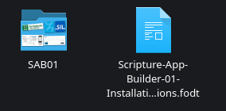

The benifit and reason why this repo uses this system is that it makes it increadibly easy to swtich out images in a document. Since screenshots containing english text will not be translated by crowdin the next best solution is to replace these screenshots with ones containing text in the correct language. The github workflow will automatically replace the screenshots, however the user still needs to manually supply all screenshots. The images are located in images/(language)/(app builder name)/(image folder) and do not need to conform a specific file format. Simply drop the images into the correct folder and the workflow will handle the rest.

### Workflow

Navigate to the actions tab.

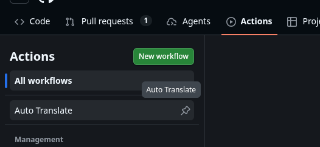

Find the "run workflow" button on the right side of the screen and select the dropdown menu. Click the "Run workflow" option.

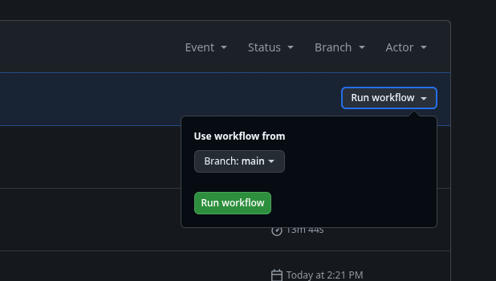

The workflow is now running in the background. You can click the "Convert" button to view the output of the workflow.

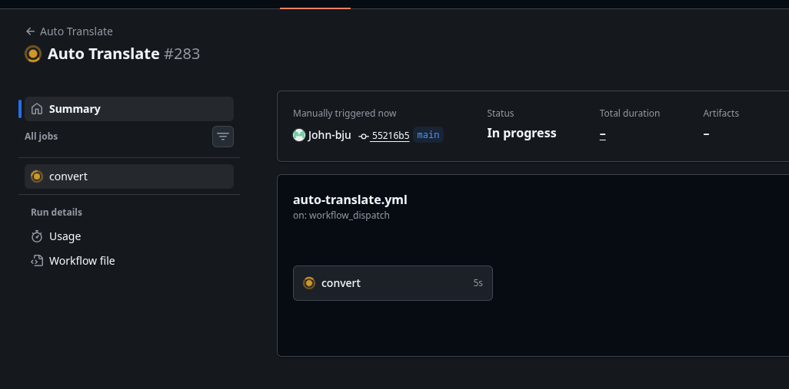

#
### Crowdin Sync
Crowdin developed a github integration allowing Github Workflows to send and receive files with Crowdin projects. This integration is used to sync this github repo and a Crowdin project allowing translations to be created and downloaded into a separate branch named "translations". This process is automated by the workflow and requires no user input to run.

###### Tokens
In order to set up the github integration there are three tokens that need to be entered into the github secrets tab in the settings of the repo.

`CROWDIN_PERSONAL_TOKEN:` This can be created by clicking on the user's profile picture and selecting "settings".

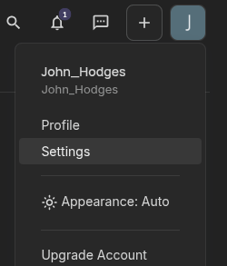

Then find the "API" tab and clicking on it

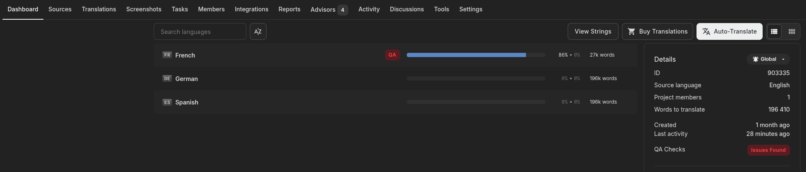

Then selecting "New Token" under "Personal Access Tokens" and a token will be generated.

`CROWDIN_PROJECT_ID:` This can be found on the crowdin project webpage on the right hand side under the "dashboard" tab.

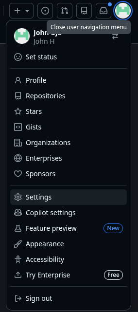

`CROWDIN_GITHUB_TOKEN:` This can be generated by clicking on the user's profile picture and selecting "settings".

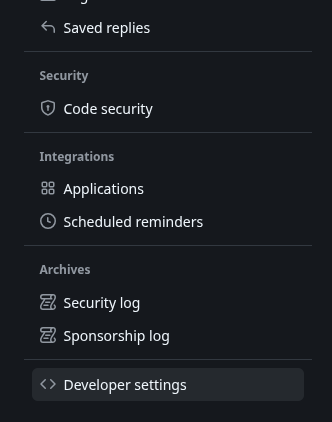

Then scrolling down to find the "Developer Settings" tab and clicking on it.

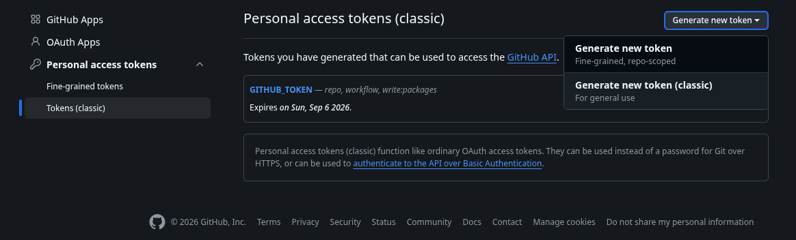

Then selecting "Tokens (classic)" under "Personal Access Tokens" and selecting "Generate new token (classic)".

###### How to add tokens to the repo.
First you must be an administrator to the gihub repo, if you are not then you need to contact one. Next navigate over to the settings tab at the top and select it, then find the "Secrets and variables" button and select "Actions". Then add each token as a secret with a name given in this document.

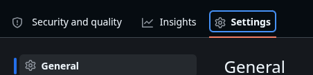

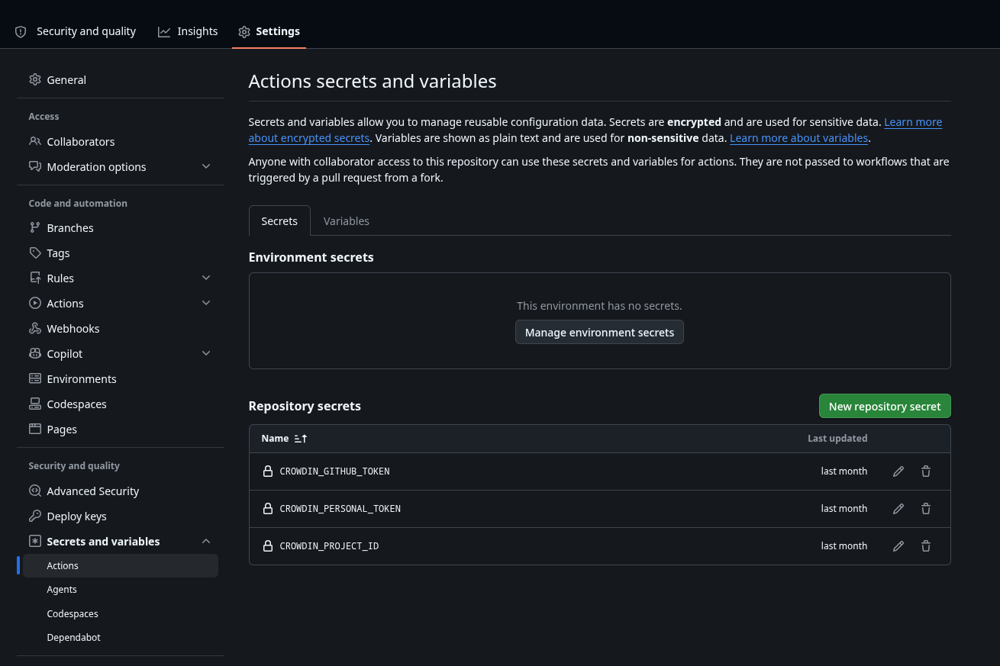

In addition, the `CROWDIN_PROJECT_ID` must be manually entered into the `project_id: "XXXXXX"` field in the "crowdin.yaml" file, which is located inside the repo.

#
### Outputs
The workflow will produce two types of outputs. First it will generate all the translated files in their correct formats and add them to the "translations branch". The user can then decide to either merge the translations branch into the main branch if they wanted to put the most recent documentation front and center.

Second the workflow will generate a an artifact comprised of all the pdfs of one language in a .zip file. This can be found by going to the workflow and viewing the build summary.

# Crowdin Settings
To properly use Crowdin with this github workflow it is nessesary to tweak certain features of the software to get the best results.
### Duplicate Strings
A setting that needs to be enabled is "Duplicate Strings", it allows two identical sentences to only be translated as one. This reduces the total word count and SIL to be billed less by Crowdin. 

To enable this you need to go into the "settings" tab at the very right.

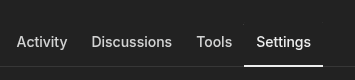

Then scroll down to the "import" bar and select it.

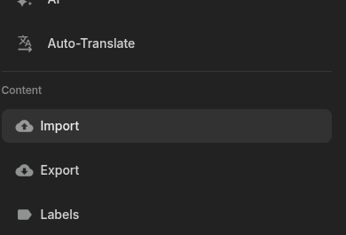

After that look to the right to find the "duplicate strings" menu select the "Hide (strict detection)" option.

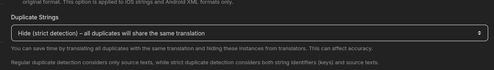

You will also select "Skip tags" under "Word and character count". This also reduces the word count by not counting tags used for data as words.

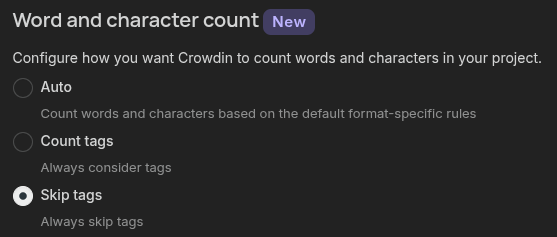
