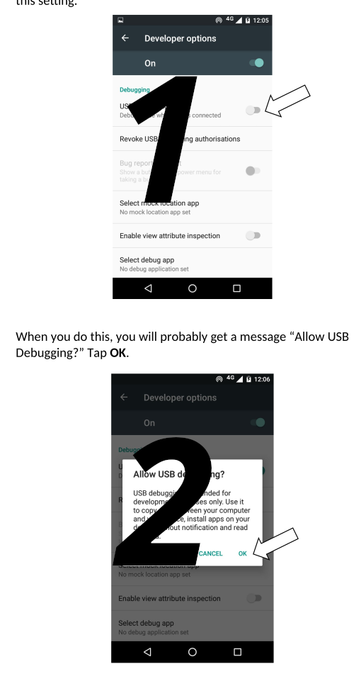
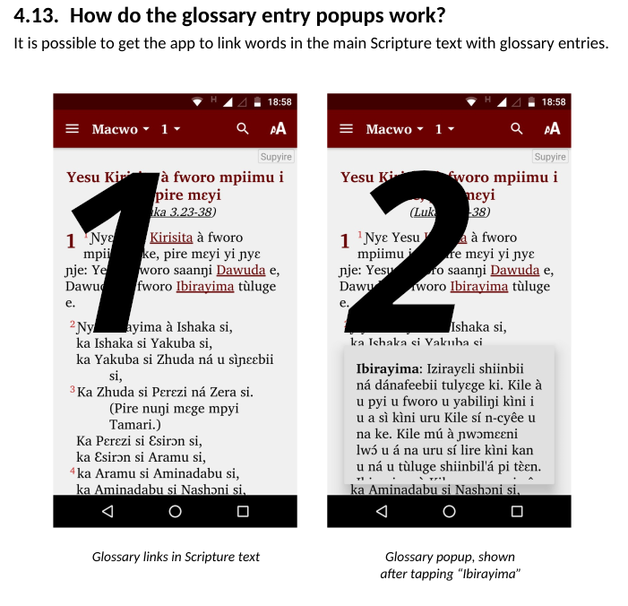

# SIL Translation Test

### Description
This repo is for documentation of SAB, RAB, DAB, KAB which aims to keep a version history of all documents and translate them into several languages via crowdin translation. This repo will also automatically convert, format, and output documentation as the user needs.

# How to Use
### Submitting
All submissions should be put into the main branch of the github repo, and should be added into the following locations.

###### Documents
All documents should be in .fodt format and should only be added (or modifed) in `docs-en/fodt/(app builder name)/(file)` for example `"docs-en/fodt/SAB/Scripture-App-Builder-01-Installation-Instructions.fodt".`

###### Images
All images should be submitted to `images/(language)/(app builder name)/(image folder)` for example `"images/en-EN/KAB/KAB02".` Images should also be numbered according to their order in a document. For example the first image would be named 1.png, the second would be 2.png, etc. This operates top to bottom and when images don't have a clear vertical order, left to right.

#
### Crowdin Sync
Crowdin developed a github integration allowing Github Workflows to send and receive files with Crowdin projects. This integration is used to sync this github repo and a Crowdin project allowing translations to be created and downloaded into a separate branch named "translations". This process is automated by the workflow and requires no user input to run.

###### Tokens
In order to set up the github integration there are three tokens that need to be entered into the github secrets tab in the settings of the repo.

`CROWDIN_PERSONAL_TOKEN:` This can be created by clicking on the user's profile picture and selecting "settings".

Then find the "API" tab and clicking on it

Then selecting "New Token" under "Personal Access Tokens" and a token will be generated.

`CROWDIN_PROJECT_ID:` This can be found on the crowdin project webpage on the right hand side under the "dashboard" tab.

`CROWDIN_GITHUB_TOKEN:` This can be generated by clicking on the user's profile picture and selecting "settings".

Then scrolling down to find the "Developer Settings" tab and clicking on it.

Then selecting "Tokens (classic)" under "Personal Access Tokens" and selecting "Generate new token (classic)".

###### How to add tokens to the repo.
First you must be an administrator to the gihub repo, if you are not then you need to contact one. Next navigate over to the settings tab at the top and select it, then find the "Secrets and variables" button and select "Actions". Then add each token as a secret with a name given in this document.

#
### Outputs
The workflow will output pdf's as an artifact and will push all translated docs into the "translations" branch. The user can then decide to either merge them into the main branch if they wanted to put the most recent documentation front and center.

